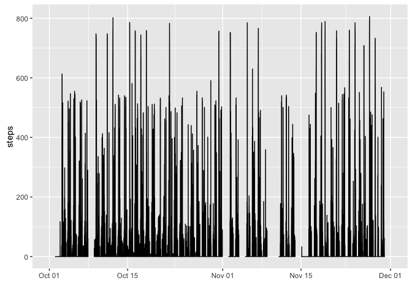
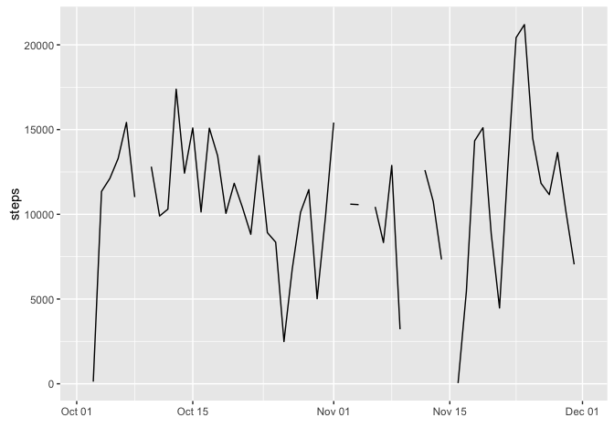
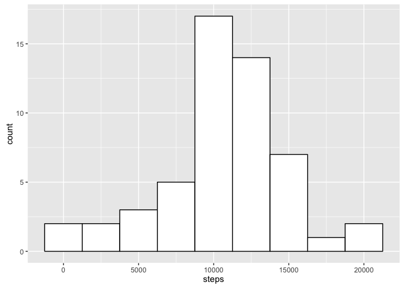
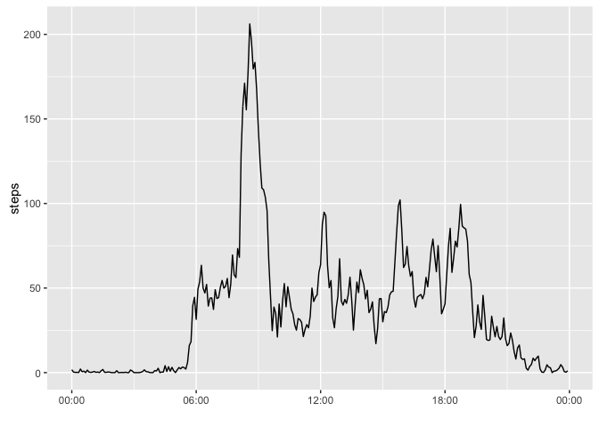
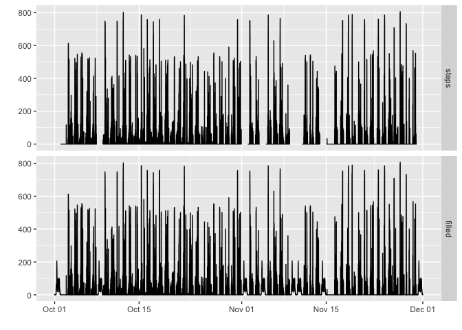
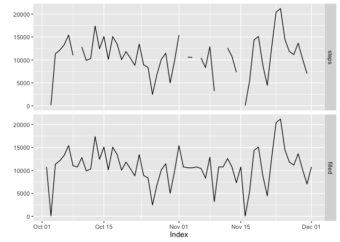
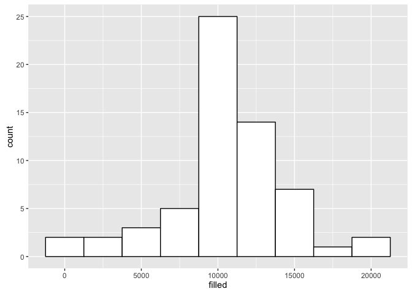
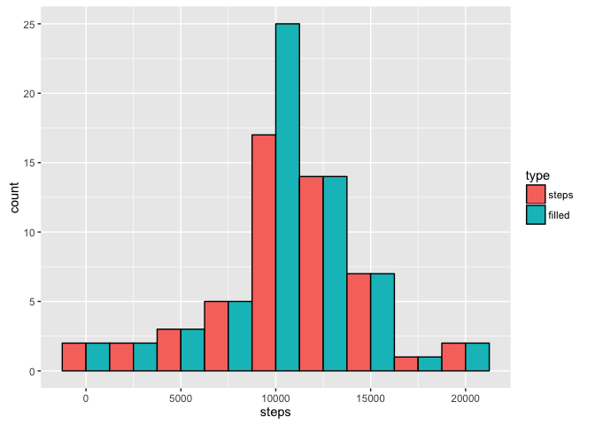
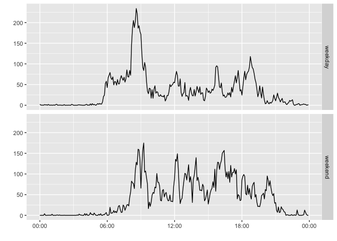

# Reproducible Research: Peer Assessment 1
Smiley121  
18 December 2016  


## Introduction

This is a report in response to peer assessment 1 for the Coursera Reproducible Research course.
The assignment makes use of [data](https://d396qusza40orc.cloudfront.net/repdata%2Fdata%2Factivity.zip) from a personal activity monitoring device. This device collects data at 5 minute intervals through out the day. The data consists of two months of data from an anonymous individual collected during the months of October and November, 2012 and include the number of steps taken in 5 minute intervals each day.

The variables included in this dataset are:

* steps: Number of steps taking in a 5-minute interval (missing values are coded as `NA`)
* date: The date on which the measurement was taken in YYYY-MM-DD format
* interval: Identifier for the 5-minute interval in which measurement was taken

The dataset is stored in a comma-separated-value (CSV) file and there are a total of 17,568 observations in this dataset.

## Loading and preprocessing the data

### 0. Loading some libraries

We make use of a number of libraries (lubridate, dplyr, ggplot2, xts, scales and tidyr) here. I'm sure simpler solutions to the assignment are possible...


```r
if  (!require(lubridate)) {
  install.packages("lubridate", repos = "http://cran.us.r-project.org")
  library(lubridate)
}
```

```
## Loading required package: lubridate
```

```
## 
## Attaching package: 'lubridate'
```

```
## The following object is masked from 'package:base':
## 
##     date
```

```r
if  (!require(dplyr)) {
  install.packages("dplyr", repos = "http://cran.us.r-project.org")
  library(dplyr)
}
```

```
## Loading required package: dplyr
```

```
## 
## Attaching package: 'dplyr'
```

```
## The following objects are masked from 'package:lubridate':
## 
##     intersect, setdiff, union
```

```
## The following objects are masked from 'package:stats':
## 
##     filter, lag
```

```
## The following objects are masked from 'package:base':
## 
##     intersect, setdiff, setequal, union
```

```r
if  (!require(ggplot2)) {
  install.packages("ggplot2", repos = "http://cran.us.r-project.org")
  library(ggplot2)
}
```

```
## Loading required package: ggplot2
```

```r
if  (!require(xts)) {
  install.packages("xts", repos = "http://cran.us.r-project.org")
  library(xts)
}
```

```
## Loading required package: xts
```

```
## Loading required package: zoo
```

```
## 
## Attaching package: 'zoo'
```

```
## The following objects are masked from 'package:base':
## 
##     as.Date, as.Date.numeric
```

```
## 
## Attaching package: 'xts'
```

```
## The following objects are masked from 'package:dplyr':
## 
##     first, last
```

```r
if  (!require(scales)) {
  install.packages("scales", repos = "http://cran.us.r-project.org")
  library(scales)
}
```

```
## Loading required package: scales
```

```r
if  (!require(tidyr)) {
  install.packages("tidyr", repos = "http://cran.us.r-project.org")
  library(tidyr)
}
```

```
## Loading required package: tidyr
```

```r
if  (!require(lattice)) {
  install.packages("lattice", repos = "http://cran.us.r-project.org")
  library(lattice)
}
```

```
## Loading required package: lattice
```

### 1. Load the data

We load the data from the zipped csv and make a copy of this for later.

```r
activity<-read.csv(unzip("activity.zip"),stringsAsFactors=F)
activity.orig<-activity
head(activity)
```

```
##   steps       date interval
## 1    NA 2012-10-01        0
## 2    NA 2012-10-01        5
## 3    NA 2012-10-01       10
## 4    NA 2012-10-01       15
## 5    NA 2012-10-01       20
## 6    NA 2012-10-01       25
```

```r
summary(activity)
```

```
##      steps            date              interval     
##  Min.   :  0.00   Length:17568       Min.   :   0.0  
##  1st Qu.:  0.00   Class :character   1st Qu.: 588.8  
##  Median :  0.00   Mode  :character   Median :1177.5  
##  Mean   : 37.38                      Mean   :1177.5  
##  3rd Qu.: 12.00                      3rd Qu.:1766.2  
##  Max.   :806.00                      Max.   :2355.0  
##  NA's   :2304
```

### 2. Process and transform the data

This is a time series so we should treat it as such. We first format the date as such and create timestamps from the interval numbers.


```r
activity$date <- ymd(activity$date)

activity$timestamp<-ymd_hms(paste(paste(
        activity$date,paste(
        floor(activity$interval/100),
        activity$interval%%100,
        0,
        sep=":"))))

Sys.setenv(TZ = "UTC")
```

Next we create a time series object (xts) from the steps data. We set the frequency at 288 (5 minute intervals each day) to reflect the daily pattern of activities, although this is not subsequently used in this analysis.


```r
activity.ts<-xts(activity$steps,activity$timestamp)
colnames(activity.ts)<-c("steps")
attr(activity.ts,'frequency')<-288
head(activity.ts)
```

```
##                     steps
## 2012-10-01 00:00:00    NA
## 2012-10-01 00:05:00    NA
## 2012-10-01 00:10:00    NA
## 2012-10-01 00:15:00    NA
## 2012-10-01 00:20:00    NA
## 2012-10-01 00:25:00    NA
```

Before we go much further, let's have a look at the data:


```r
autoplot(activity.ts)+xlab("")
```

```
## Warning: Removed 576 rows containing missing values (geom_path).
```

<!-- -->

Lots of NA data here, which we'll address below...

## What is mean total number of steps taken per day?

### 1. Calculate the total number of steps taken per day

We use the `apply.daily` command from the xts library to calculate the sum of steps for each day. 


```r
activity.daily<-apply.daily(activity.ts,sum)
colnames(activity.daily)<-c("steps")
head(activity.daily)
```

```
##                     steps
## 2012-10-01 23:55:00    NA
## 2012-10-02 23:55:00   126
## 2012-10-03 23:55:00 11352
## 2012-10-04 23:55:00 12116
## 2012-10-05 23:55:00 13294
## 2012-10-06 23:55:00 15420
```

Let's have a look at this as a time series.


```r
autoplot(activity.daily)+xlab("")
```

```
## Warning: Removed 2 rows containing missing values (geom_path).
```

<!-- -->

### 2. Make a histogram of the total number of steps taken each day

The chart above shows the number of steps each day as a time series, again note the missing days. Plotting this data as a histogram:


```r
ggplot(activity.daily, aes(x=steps)) + geom_histogram(binwidth=2500, colour="black", fill="white")
```

```
## Warning: Removed 8 rows containing non-finite values (stat_bin).
```

<!-- -->

### 3. Calculate and report the mean and median of the total number of steps taken per day

Note we have to ignore the NA data when calculating both the mean and the median:


```r
mean(activity.daily,na.rm=TRUE)
```

```
## [1] 10766.19
```

```r
median(activity.daily,na.rm=TRUE)
```

```
## [1] 10765
```

So we have a mean of 10766.19 steps per day and a median of 10765 steps per day.

## What is the average daily activity pattern?

### 1. Make a time series plot of the 5-minute interval and the average number of steps taken, averaged across all days

We begin by calculating the mean number of steps in each five minute interval, then transform this to a time series, taking the timestamps from the first day for this.


```r
activity.typical<-aggregate(steps ~ interval,activity,mean,na.rm=TRUE)
activity.typical.ts<-xts(activity.typical$steps,head(activity$timestamp,288))
colnames(activity.typical.ts)<-c("steps")
head(activity.typical.ts)
```

```
##                         steps
## 2012-10-01 00:00:00 1.7169811
## 2012-10-01 00:05:00 0.3396226
## 2012-10-01 00:10:00 0.1320755
## 2012-10-01 00:15:00 0.1509434
## 2012-10-01 00:20:00 0.0754717
## 2012-10-01 00:25:00 2.0943396
```

We now plot this as a time series. 

```r
autoplot(activity.typical.ts) + scale_x_datetime(labels = date_format("%H:%M")) + xlab("")
```

<!-- -->

### 2. Which 5-minute interval, on average across all the days in the dataset, contains the maximum number of steps?


```r
format(index(activity.typical.ts[which.max(activity.typical.ts$steps)]),format="%H:%M")
```

```
## [1] "08:35"
```

ie 08:35-08:40.

## Imputing missing values

### 1. Calculate and report the total number of missing values in the dataset

We create a Boolean vector showing where data is coded as `NA` and then sum this.

```r
na.rows <- is.na(activity$steps) 
sum(na.rows)
```

```
## [1] 2304
```

ie there are 2304 missing data points.

### 2. Devise a strategy for filling in all of the missing values in the dataset.

We'll simply impute missing, `NA` values by taking the value for the corresponding interval from the average daily activity.

### 3. Create a new dataset that is equal to the original dataset but with the missing data filled in.

Using the strategy above, we add a new column to the dataset and corresponding timeseries. We create a new dataset from the original by replacing the original steps column with the filled in data, because that's what we're asked to do here. There's probably a more elegant way to do this.


```r
activity$filled <- ifelse(na.rows, activity.typical$steps, activity$steps)
activity.ts$filled <- activity$filled
activity.new <- activity.orig
activity.new$steps <- activity$filled
head(activity.new)
```

```
##       steps       date interval
## 1 1.7169811 2012-10-01        0
## 2 0.3396226 2012-10-01        5
## 3 0.1320755 2012-10-01       10
## 4 0.1509434 2012-10-01       15
## 5 0.0754717 2012-10-01       20
## 6 2.0943396 2012-10-01       25
```

Whilst we're here, let's have a look at the time series now, comparing this with the original:

```r
autoplot(activity.ts)+xlab("")
```

```
## Warning: Removed 288 rows containing missing values (geom_path).
```

<!-- -->

### 4. Make a histogram of the total number of steps taken each day and Calculate and report the mean and median total number of steps taken per day

We start by creating a new daily timeseries for the imputed values and adding this alongside the orginal daily totals. Let's have a look at those together.


```r
activity.daily$filled<-apply.daily(activity.ts$filled,sum)
autoplot(activity.daily)
```

```
## Warning: Removed 1 rows containing missing values (geom_path).
```

<!-- -->

The imputed values look quite plausible, which is reasurring. 

Getting on with the histogram now: 


```r
ggplot(activity.daily, aes(x=filled)) + geom_histogram(binwidth=2500, colour="black", fill="white")
```

<!-- -->

Whoa. Lots of clustering in the centre there. Let's see the original data and the imputed data together for comparison. The code here is unpleasant as ggplot works better with tall rather than wide dataframes:


```r
df1<-data.frame(type="steps",steps=activity.daily$steps)
df2<-data.frame(type="filled",steps=activity.daily$filled)
names(df2)[2]="steps"
df<-rbind(df1,df2)
ggplot(df, aes(x=steps, fill=type))+geom_histogram(binwidth=2500, colour="black", position="dodge")
```

```
## Warning: Removed 8 rows containing non-finite values (stat_bin).
```

<!-- -->

OK, so this isn't that surprising, given that our imputation strategy was to replace `NA` with the mean number of steps in that period, hence the regression to the mean here. 

Let's look at the mean and the median from the filled data. Note this time we don't need to ignore `NA`, as there are none!

```r
mean(activity.daily$filled)
```

```
## [1] 10766.19
```

```r
median(activity.daily$filled)
```

```
## [1] 10766.19
```
Remember originally we had a mean of 10766.19 steps per day and a median of 10765 steps per day. Using the imputed data we have a mean of 10766.19 steps per day and a median of 10766.19 steps per day. The difference in mean is none, and that in median is small, which is expected given our imputation strategy.

## Are there differences in activity patterns between weekdays and weekends?

### 1. Create a new factor variable in the dataset with two levels – “weekday” and “weekend”

We create a new column in the dataframe for the day of the week, and another for the day type, making this latter a factor.


```r
activity$day <- weekdays(activity$date)
activity$daytype <- ifelse(activity$day=="Saturday" | activity$day=="Sunday","weekend","weekday")
activity$daytype <- factor(activity$daytype)
```

### 2. Make a panel plot containing a time series plot  of the 5-minute interval and the average number of steps taken, averaged across all weekday days or weekend days

We start by working out the average pattern for each day according to type. Note we're not using the imputed data here.

```r
activity.typical.bytype<-aggregate(steps ~ interval + daytype,activity,mean,na.rm=TRUE)
```

OK, let's use ggplot rather than latice (noting that this is permitted according to the readme) to to do a panel plot comparing weekdays with weekends, which involves making the time series first.  


```r
activity.typical.bytype.wide<-spread(activity.typical.bytype,daytype,steps)
activity.typical.bytype.ts<-xts(activity.typical.bytype.wide,head(activity$timestamp,288))
activity.typical.bytype.ts<-subset(activity.typical.bytype.ts, select = -c(interval))

autoplot(activity.typical.bytype.ts) + scale_x_datetime(labels = date_format("%H:%M")) + xlab("")
```

<!-- -->

Finally, let's just look at the correlation between the weekday adn weekend patterns:

```r
cor(activity.typical.bytype.ts$weekday,activity.typical.bytype.ts$weekend)
```

```
##          weekend
## weekday 0.535591
```

  
